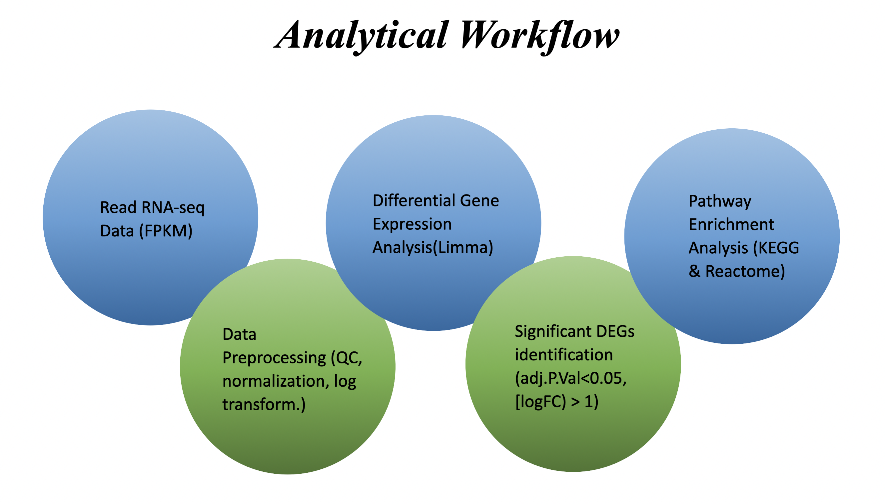
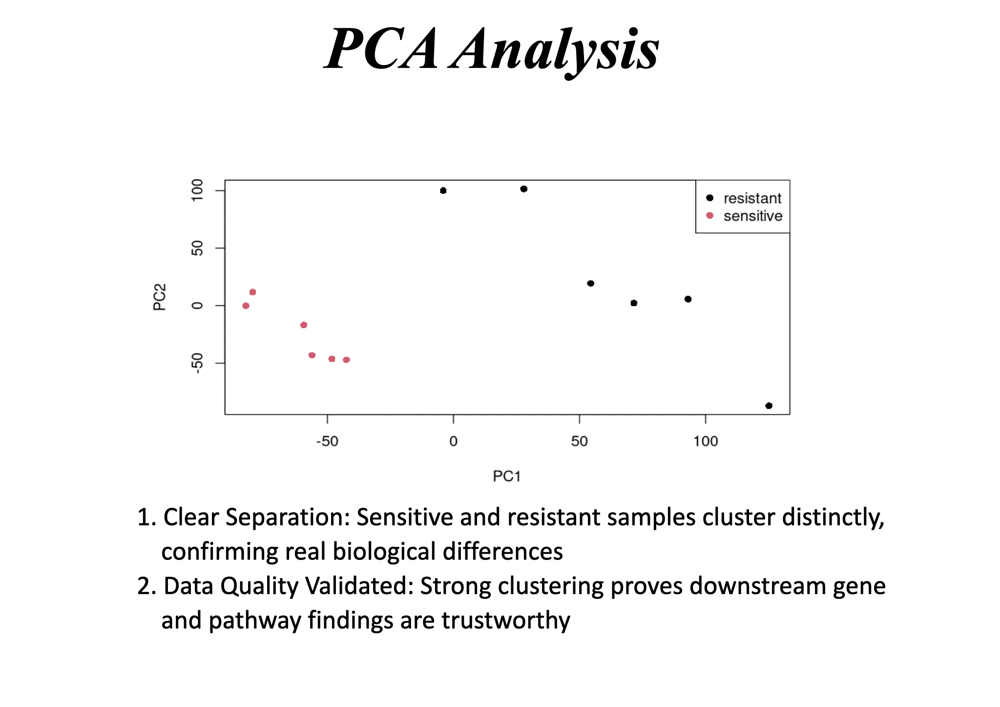
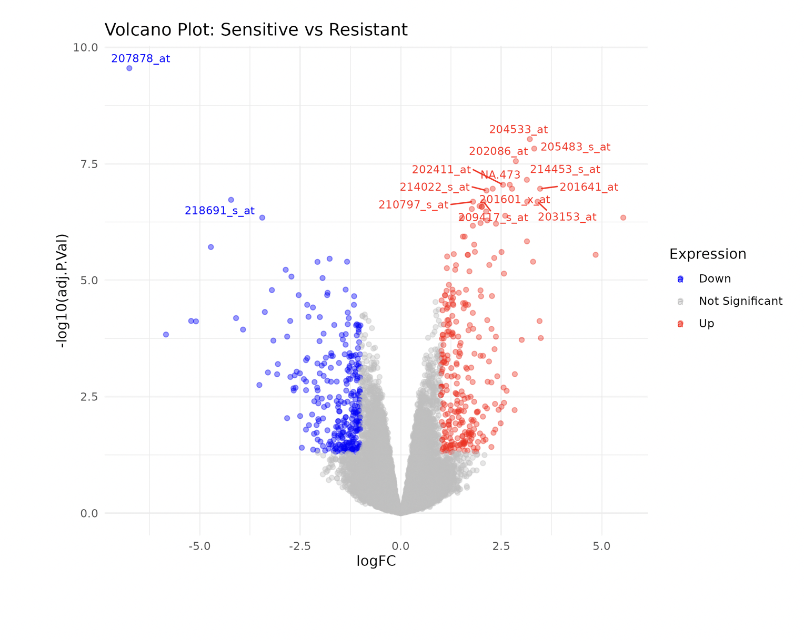
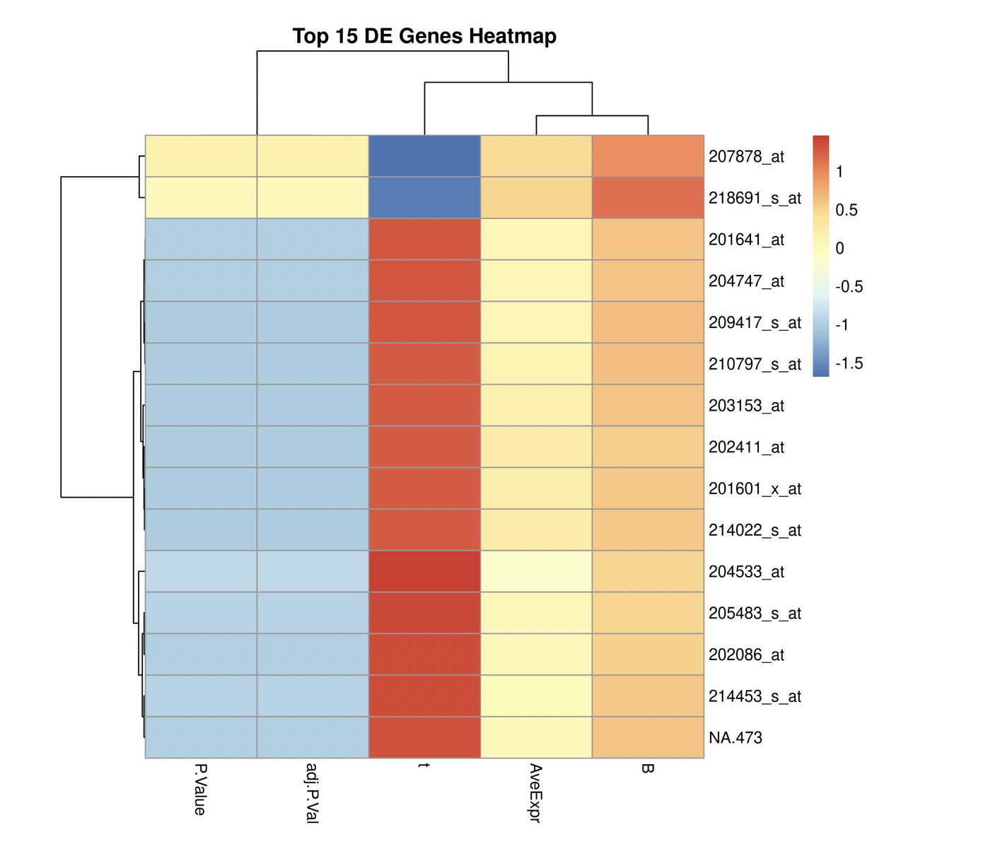
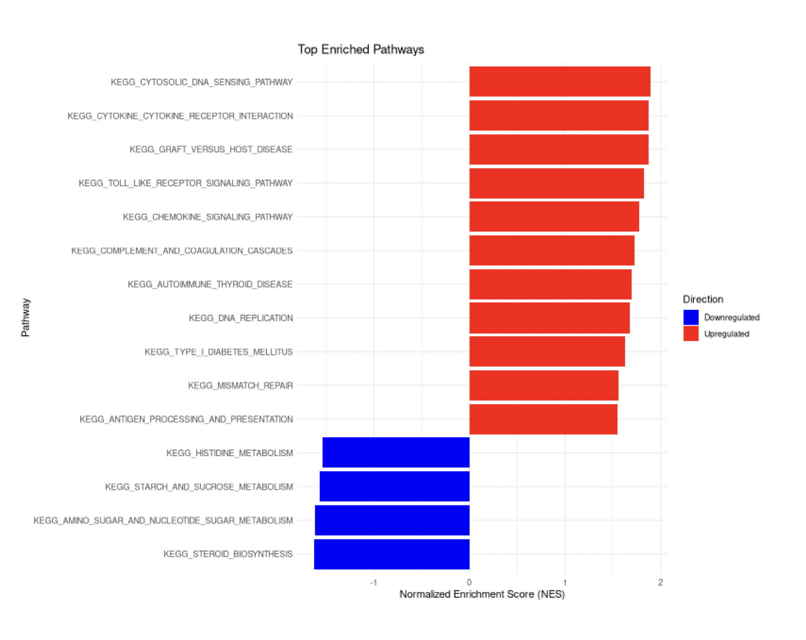
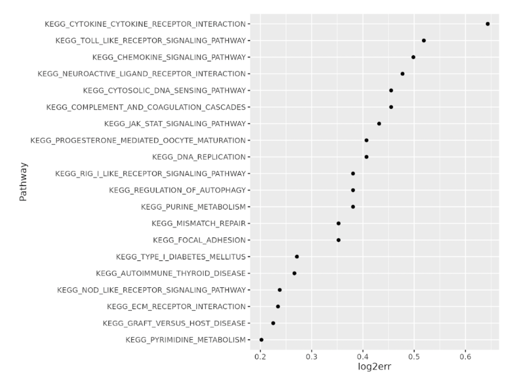

# RNA-seq Differential Gene Expression Analysis of Radiotherapy Resistance

## Overview

This project investigates transcriptomic differences between radiotherapy-sensitive and radiotherapy-resistant samples using RNA-seq data.

The workflow includes PCA, differential expression analysis using limma, volcano plot visualization, heatmap generation, KEGG enrichment, and Reactome pathway analysis.

## Biological Question

Which genes and pathways are associated with radiotherapy resistance?

## Methods

- RNA-seq expression data preprocessing
- Log transformation
- Differential expression analysis using limma
- Significant DEG filtering using adjusted p-value < 0.05 and |logFC| > 1
- PCA visualization
- Volcano plot and heatmap analysis
- KEGG and Reactome pathway enrichment

## Key Findings

- Sensitive and resistant samples showed clear separation in PCA.
- Significant upregulated and downregulated genes were identified.
- KEGG analysis highlighted immune, inflammatory, DNA repair, and metabolic pathways.
- Reactome analysis highlighted interferon signalling, cell cycle regulation, PI3K-AKT signalling, and TP53 regulation.

## Skills Demonstrated

- RNA-seq analysis
- Differential gene expression analysis
- R programming
- Data visualization
- Pathway enrichment analysis
- Biological interpretation

## Author

Prithvi Athreya Jagadish  
MSc Bioinformatics, University of Birmingham

## Workflow

## PCA Analysis

## Volcano Plot

## Heatmap

## KEGG Enrichment

## Reactome Enrichment

